# 🏗️ Employee & Time Management Platform - System Architecture

## 📊 System Architecture Diagram

```mermaid
graph TB
    %% Frontend Layer
    subgraph "🎨 Frontend Layer (Next.js 15)"
        UI[Next.js App Router]
        PAGES[Pages & Components]
        UI --> PAGES
        
        subgraph "📱 User Interfaces"
            DASH[Dashboard]
            EMP[Employee Management]
            TASK[Task Management]
            TIME[Time Tracking]
            CHAT[Real-time Chat]
            CAL[Calendar Integration]
            REP[Reports & Analytics]
            PAY[Payroll Management]
            GAME[Gamification]
        end
        
        PAGES --> DASH
        PAGES --> EMP
        PAGES --> TASK
        PAGES --> TIME
        PAGES --> CHAT
        PAGES --> CAL
        PAGES --> REP
        PAGES --> PAY
        PAGES --> GAME
    end

    %% Authentication Layer
    subgraph "🔐 Authentication & Authorization"
        CLERK[Clerk Authentication]
        RBAC[Role-Based Access Control]
        MIDDLEWARE[Next.js Middleware]
        
        CLERK --> RBAC
        RBAC --> MIDDLEWARE
    end

    %% API Layer
    subgraph "⚡ API Layer (Next.js API Routes)"
        API[REST API Endpoints]
        
        subgraph "🔗 API Routes"
            API_EMP["/api/employees"]
            API_TASK["/api/tasks"]
            API_SPRINT["/api/sprints"]
            API_TIME["/api/time-entries"]
            API_CHAT["/api/chat"]
            API_CAL["/api/calendar"]
            API_REP["/api/reports"]
            API_PAY["/api/payroll"]
            API_NOTIF["/api/notifications"]
            API_LEAVE["/api/leave-requests"]
        end
        
        API --> API_EMP
        API --> API_TASK
        API --> API_SPRINT
        API --> API_TIME
        API --> API_CHAT
        API --> API_CAL
        API --> API_REP
        API --> API_PAY
        API --> API_NOTIF
        API --> API_LEAVE
    end

    %% Database Layer
    subgraph "🗄️ Database Layer"
        DB[(PostgreSQL Database)]
        PRISMA[Prisma ORM]
        
        subgraph "📋 Database Models"
            M_EMP[Employee]
            M_DEPT[Department]
            M_TASK[Task/SubTask]
            M_SPRINT[Sprint]
            M_TIME[TimeEntry]
            M_PROJ[Project]
            M_CHAT[ChatMessage]
            M_NOTIF[Notification]
            M_LEAVE[LeaveRequest]
            M_MEET[Meeting]
            M_PAY[Payroll]
        end
        
        PRISMA --> DB
        DB --> M_EMP
        DB --> M_DEPT
        DB --> M_TASK
        DB --> M_SPRINT
        DB --> M_TIME
        DB --> M_PROJ
        DB --> M_CHAT
        DB --> M_NOTIF
        DB --> M_LEAVE
        DB --> M_MEET
        DB --> M_PAY
    end

    %% Real-time Services
    subgraph "⚡ Real-time Services"
        PUSHER[Pusher WebSocket]
        REALTIME[Real-time Updates]
        
        PUSHER --> REALTIME
        
        subgraph "📡 Real-time Features"
            RT_CHAT[Chat Messages]
            RT_NOTIF[Notifications]
            RT_TIME[Time Tracking]
            RT_TASK[Task Updates]
        end
        
        REALTIME --> RT_CHAT
        REALTIME --> RT_NOTIF
        REALTIME --> RT_TIME
        REALTIME --> RT_TASK
    end

    %% External Services
    subgraph "🌐 External Services"
        EMAIL[Resend Email]
        CLOUD[Cloudinary Storage]
        GCAL[Google Calendar API]
        BANK[Bank/Mobile APIs]
        
        subgraph "📧 Notification Services"
            EMAIL_NOTIF[Email Notifications]
            EMAIL_PAY[Pay Slip Emails]
        end
        
        EMAIL --> EMAIL_NOTIF
        EMAIL --> EMAIL_PAY
    end

    %% Connections
    UI --> CLERK
    MIDDLEWARE --> API
    API --> PRISMA
    API --> PUSHER
    API --> EMAIL
    API --> CLOUD
    API --> GCAL
    API --> BANK
    
    %% Styling & Components
    subgraph "🎨 UI/UX Layer"
        TAILWIND[Tailwind CSS]
        SHADCN[Shadcn/UI Components]
        ICONS[Lucide Icons]
        CHARTS[Recharts]
        
        UI --> TAILWIND
        UI --> SHADCN
        UI --> ICONS
        UI --> CHARTS
    end

    %% User Roles
    subgraph "👥 User Types"
        ADMIN[👑 Admin]
        MANAGER[👔 Manager]
        EMPLOYEE[👤 Employee]
        INTERN[🎓 Intern]
    end
    
    ADMIN --> CLERK
    MANAGER --> CLERK
    EMPLOYEE --> CLERK
    INTERN --> CLERK
```



## 🔧 Technology Stack Details

### **Frontend Technologies**
- **Framework**: Next.js 15 with App Router
- **Language**: TypeScript
- **Styling**: Tailwind CSS
- **Components**: Shadcn/UI
- **Icons**: Lucide React
- **Charts**: Recharts
- **Drag & Drop**: dnd-kit
- **Calendar**: FullCalendar.js
- **State Management**: React Query (TanStack Query)

### **Backend Technologies**
- **API**: Next.js API Routes
- **Database**: PostgreSQL (Neon)
- **ORM**: Prisma
- **Authentication**: Clerk
- **Real-time**: Pusher
- **File Storage**: Cloudinary
- **Email**: Resend
- **Validation**: Zod

### **Database Schema**
```prisma
// Core Models
Employee ← Department
Task ← Employee, Project, Sprint
TimeEntry ← Employee
Project ← Department
Sprint → Task[]
Meeting ← Employee[]
LeaveRequest ← Employee

// Chat & Collaboration
ChatMessage ← Employee
ChatChannel ← Department
Notification ← Employee
Comment ← Task, Project

// Advanced Features
InternProfile ← Employee
Resource ← Department
CalendarSyncSettings ← Employee
WeeklySummary ← Employee
```

## 🌊 Data Flow Architecture

### **1. Authentication Flow**
```
User Login → Clerk → JWT Token → Middleware → RBAC → Route Access
```

### **2. API Request Flow**
```
Frontend → API Route → Authentication Check → Database Query → Response
```

### **3. Real-time Updates Flow**
```
Action → API Route → Database Update → Pusher Event → Frontend Update
```

### **4. Time Tracking Flow**
```
Clock In/Out → TimeEntry Creation → Real-time Update → Manager Approval → Payroll Calculation
```

### **5. Task Management Flow**
```
Sprint Creation → Task Assignment → Employee Dashboard → Status Updates → Progress Tracking
```

## 🏛️ System Components

### **Core Modules**
1. **Employee Management**: CRUD operations, departments, roles
2. **Task Management**: Kanban board, sprints, assignments
3. **Time Tracking**: Clock in/out, breaks, overtime, approvals
4. **Project Organization**: Multi-project support, deadlines
5. **Real-time Chat**: Team channels, direct messages
6. **Calendar Integration**: Events, meetings, deadlines sync
7. **Reports & Analytics**: Performance metrics, exports
8. **Payroll Management**: Salary processing, pay slips
9. **Leave Management**: Request/approval workflow
10. **Gamification**: Achievements, leaderboards

### **Security Features**
- **Authentication**: Clerk with JWT tokens
- **Authorization**: Role-based access control (RBAC)
- **Data Validation**: Zod schemas for type safety
- **Secure API**: Protected routes with middleware
- **Database Security**: Prisma with prepared statements

### **Performance Optimizations**
- **Server-Side Rendering**: Next.js App Router
- **Database Queries**: Optimized Prisma queries
- **Caching**: React Query for client-side caching
- **Real-time**: Efficient WebSocket connections
- **Image Optimization**: Cloudinary CDN

## 🚀 Deployment Architecture

### **Production Environment**
```
Vercel (Frontend) → Neon (Database) → Pusher (WebSocket) → Cloudinary (Storage)
```

### **Development Environment**
```
Local Next.js → Local PostgreSQL → Local Pusher → Local Environment
```

## 📊 System Metrics

- **Total Components**: 50+ React components
- **API Endpoints**: 40+ REST endpoints
- **Database Models**: 20+ Prisma models
- **User Roles**: 4 (Admin, Manager, Employee, Intern)
- **Real-time Features**: Chat, notifications, time tracking
- **Export Formats**: Excel, PDF, CSV
- **Authentication Methods**: Email/password, OAuth

## 🔄 Integration Points

### **External APIs**
- **Google Calendar**: Event synchronization
- **Bank APIs**: Payment processing
- **Email Service**: Automated notifications
- **File Storage**: Document management

### **Internal Integrations**
- **Chat ↔ Notifications**: Message alerts
- **Tasks ↔ Calendar**: Deadline tracking
- **Time ↔ Payroll**: Automated calculations
- **Projects ↔ Reports**: Performance analytics

---

**🎯 This architecture supports a scalable, maintainable, and feature-rich employee management platform with enterprise-grade capabilities.**
